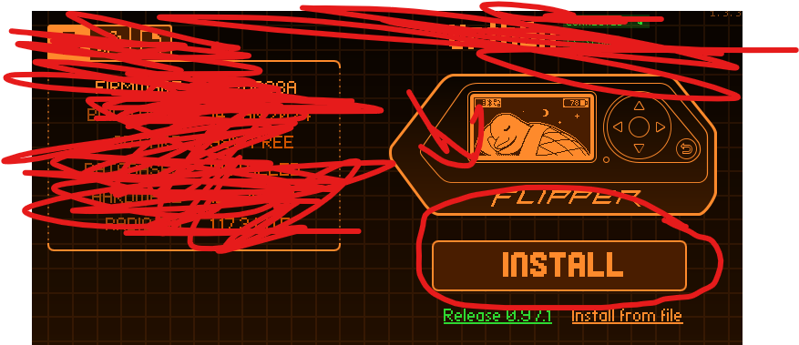
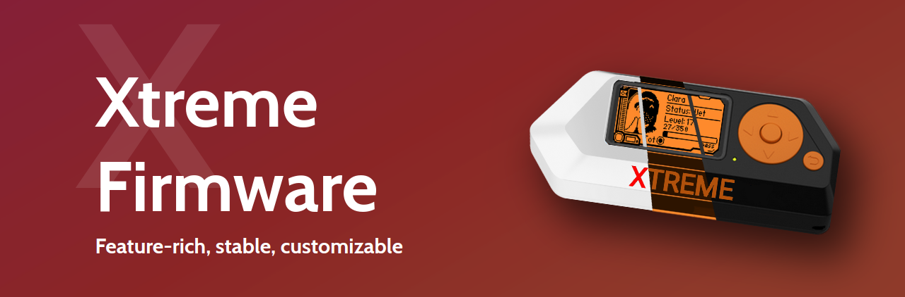
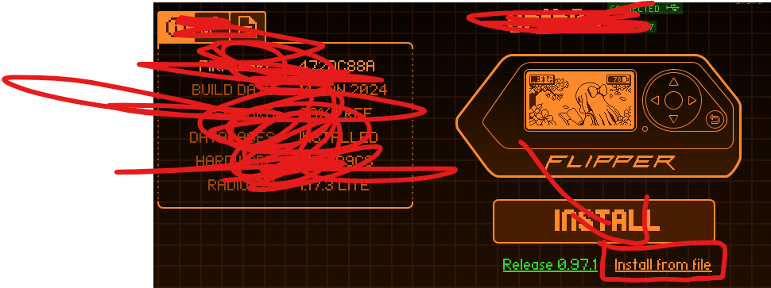
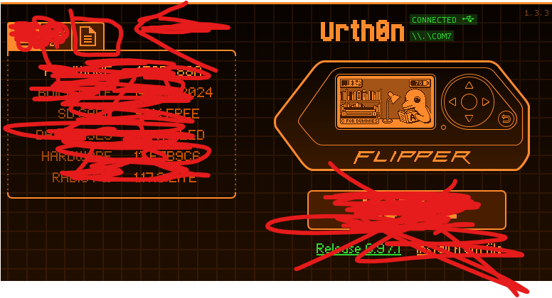
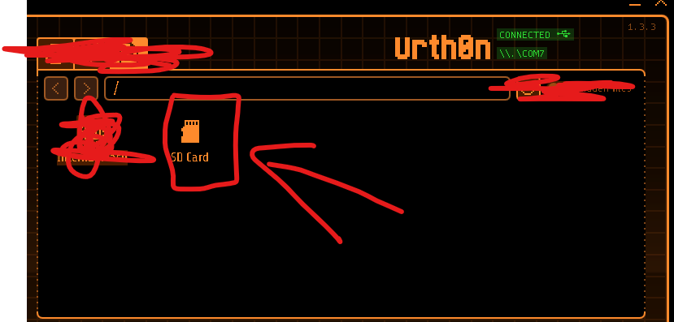
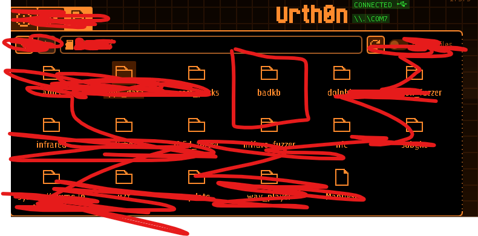
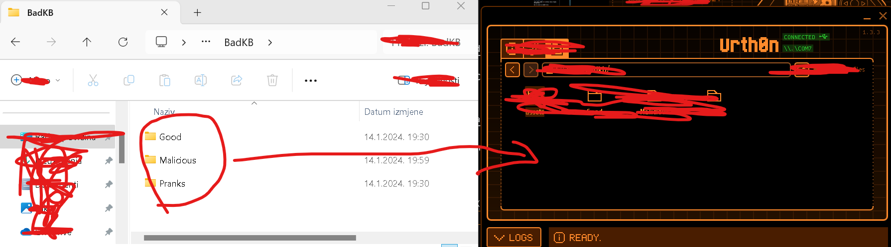

# All-for-Flipper

## All files that you need at start

### Getting started

To get started, we will have to download qFlipper

1. Open folder **Qflipper** choose folder with your **operating system** and run that file.

2. Put the sdcard into Flipper Zero making sure sd card **upside down**

3. After downloading and setup, **plug** in your Flipper zero using _**cable that came in the box**_ (because it delivers data and power)

4. Press **install** in the qFlipper app

5. We can Install Custom firmware now

### Why install Custom firmware?

Custom firmwares are best because you don't have to install apps by yourself

We will be installing Custom firmware called [Xtreme Firmware](https://flipper-xtre.me/)

If you're going to install apps, you will need to know that you're running Xtreme Developer version

Here are steps to download it:

1. Open qFlipper

2. **Plug** in your Flipper zero using _**cable that came in the box**_

3. `Click install from file`

4. Select file `Xtreme-Latest/XFW-DEV_@XXXXXXX.tgz` (dont unzip)

5. Confirm and **DONT UNPLUG FLIPPER ZERO** (if you unplug enter DFU mode)

### My BadKb files

Learn about badKB [here](https://docs.flipper.net/bad-usb)

How to install my BadKB files:

1. Open qFlipper and connect Flipper Zero with your PC

2. Enter files of Flipper Zero

3. Click `Sd Card`

4. You can now see Flipper's folders. Click `BadKB`

5. Make sure to change credentials from my BadKB files (for example: change `YOUR_DISCORD_WEBHOOK`)

6. You can copy files from folder `BadKB` in my repository into qFlipper

